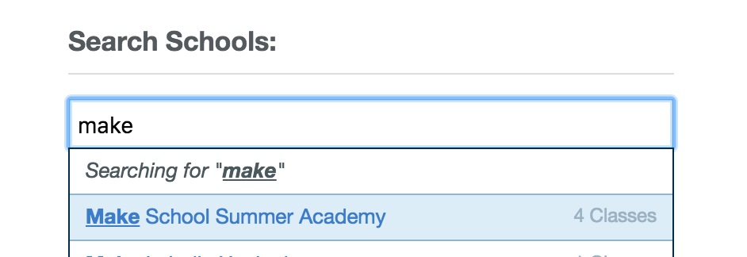
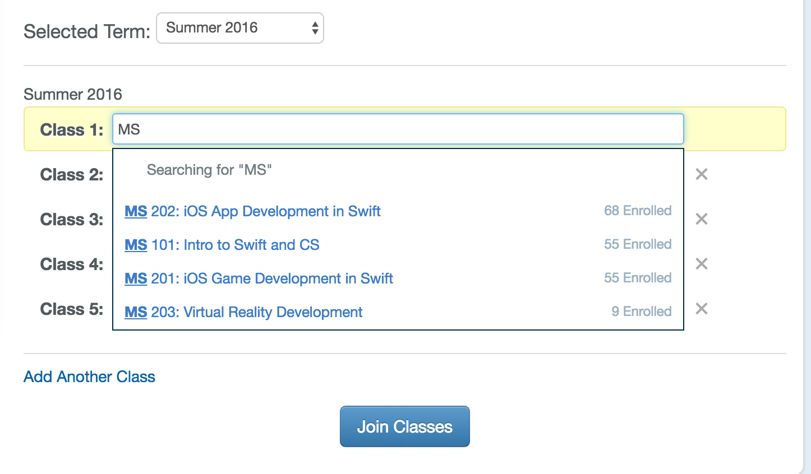
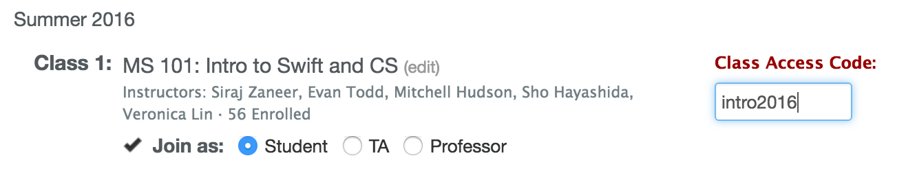
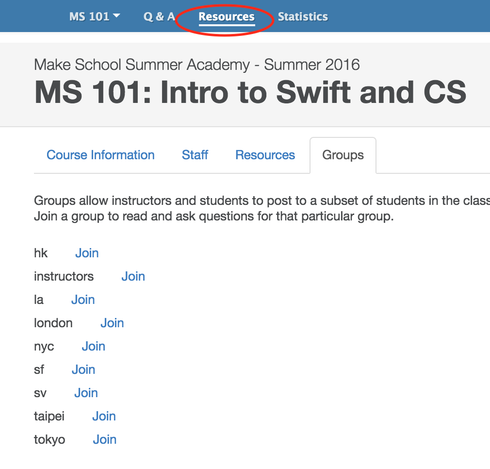
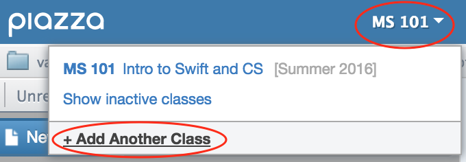
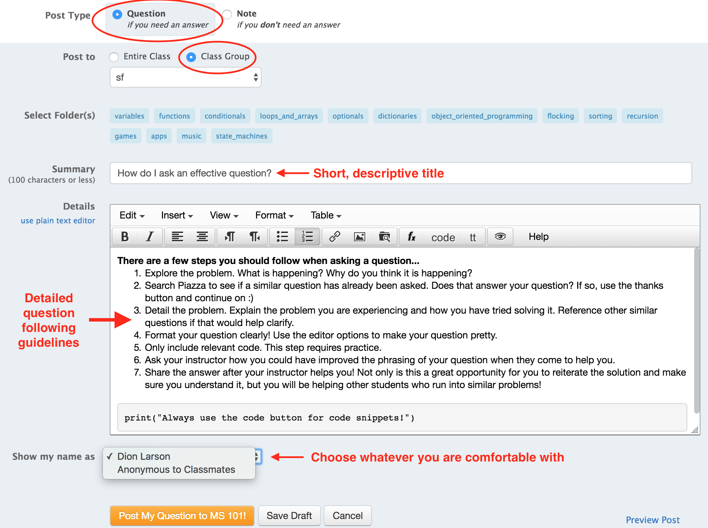

We'll be using Piazza for asking questions during the Summer Academy. To get started, you'll need to create a Piazza account.

> [action]
>
1. Go to [Piazza](https://piazza.com), click _Sign Up_, then click _Students Get Started_.
1. Search for and select _Make School Summer Academy_.

1. Search for _MS_ and join the correct course.

1. Enter your course's access code: _intro2016, games2016, apps2016, vr2016_.

1. Finish the enrollment process.
1. Once inside the correct course, click `Resources` and join the correct group for your location.

>
### Already have a Piazza account?
> You'll need to switch schools for the Summer Academy. Just make sure to switch it back when the Summer Academy is finished.
>
1. Log into Piazza.
1. Open the course menu and click "Add another class".

1. Click "Change School" and continue with step 2 above.

# Asking questions on Piazza

We'll be using Piazza for all questions during independent tutorial time.

## What? Why?

The art of asking questions is one of the most useful skills you will learn this summer. Once you finish up with the Summer Academy, you'll be on your own. Websites like Stack Overflow, developer forums, and messaging your peers will be how you find help. How can they help you if you cannot explain your issue to them?

Remember, a lot of the help you'll get in the real world will be through the internet!

## How will I receive help?

An instructor will come by to help you after you post your question. They'll provide feedback on your "question asking skills" and help you through your problem. Once they're done helping you, then you'll go back and answer your own question.

## ...answer my own question?

Yes! This a great opportunity for you to reiterate the solution and make sure you understand it. Additionally, you will be helping other students who run into similar problems!

Answering questions online is a huge part of being a developer. How can you expect random people on Stack Overflow to help you out if you never help others? The practice of answering questions allows you to give back to the same community that you rely on. A great developer always shares their knowledge with others!

# Asking effective questions

Follow these guidelines to ask effective questions:

1. _Explore the problem_. What is happening? Why do you think it is happening?
1. _Search Piazza to see if a similar question has already been asked_. 1. Does that answer your question? If so, click the "thanks!" button on the answer and move on with the tutorials.
1. _Detail the problem_. Explain the problem you are experiencing and how you have tried solving it. Reference other similar questions if that would help clarify.
1. _Format your question clearly!_ Use the editor options to make your question pretty.
1. _Only include relevant code_. This step requires practice.
1. _Ask your instructor_ how you could have improved the phrasing of your question when they come to help you.
1. _Share the answer after your instructor helps you!_ This a great opportunity for you to reiterate the solution and make sure you understand it. You will be helping other students who run into similar problems!

> [action]
> ### See this screenshot for an overview of asking a question on Piazza:

>
- Make sure to post it as a question to your class group.
- You can post anonymously if you would like.
- **For the first week of classes, please include a rough description of where you are sitting (at the end of your question) so that instructors can find you easily!**
